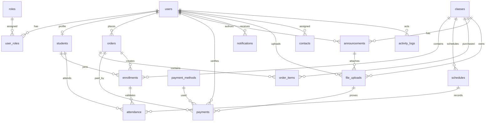

# Paypay PostgreSQL Database Architecture

This design targets PostgreSQL on Supabase with Prisma. It uses UUID primary keys, normalized relations, audit timestamps, explicit foreign keys, enum-backed statuses, and indexes for common dashboard, student, class, order, and payment workflows.

## Table Design

| Table | Purpose | Key Columns | Primary Key | Foreign Keys | Constraints | Indexes |
| --- | --- | --- | --- | --- | --- | --- |
| `users` | Application user profile linked to auth identity. | `id uuid`, `email citext`, `full_name`, `phone`, `avatar_url`, `is_active`, `last_login_at`, `created_at`, `updated_at` | `id` | None in portable SQL. In Supabase, use same value as `auth.users.id`. | `email unique`, nonblank `full_name` | `email` |
| `roles` | RBAC role catalog. | `id`, `name`, `description`, timestamps | `id` | None | `name unique`, nonblank `name` | unique `name` |
| `user_roles` | Many-to-many role assignment. | `id`, `user_id`, `role_id`, timestamps | `id` | `user_id -> users on delete cascade`, `role_id -> roles on delete cascade` | unique `(user_id, role_id)` | `role_id` |
| `students` | Student-specific profile data. | `id`, `user_id`, `student_number`, guardian fields, `status`, `notes`, timestamps | `id` | `user_id -> users on delete cascade` | `user_id unique`, `student_number unique` | `status` |
| `classes` | Sellable and enrollable class records. | `id`, `slug`, `title`, `description`, `instructor_name`, `capacity`, `price_cents`, `currency`, `status`, `published_at`, timestamps | `id` | None | `slug unique`, positive capacity, nonnegative price | `status`, `published_at` |
| `schedules` | Individual class meetings. | `id`, `class_id`, `starts_at`, `ends_at`, `timezone`, `meeting_url`, `location`, timestamps | `id` | `class_id -> classes on delete cascade` | `ends_at > starts_at` | `(class_id, starts_at)`, `starts_at` |
| `enrollments` | Student membership in classes. | `id`, `student_id`, `class_id`, `order_id`, `status`, `enrolled_at`, `dropped_at`, timestamps | `id` | `student_id -> students cascade`, `class_id -> classes cascade`, `order_id -> orders set null` | unique `(student_id, class_id)` | `(class_id, status)`, `(student_id, status)`, `order_id` |
| `payment_methods` | Supported payment rails such as bank transfer or GCash. | `id`, `code`, `name`, `instructions`, `is_active`, timestamps | `id` | None | `code unique`, nonblank `code/name` | `is_active` |
| `orders` | Checkout header. | `id`, `order_number`, `user_id`, `student_email`, `student_name`, `status`, `subtotal_cents`, `discount_cents`, `total_cents`, `currency`, `expires_at`, `paid_at`, timestamps | `id` | `user_id -> users set null` | `order_number unique`, amount math check | `(user_id, created_at)`, `(status, created_at)`, `student_email` |
| `order_items` | Normalized class line items for orders. | `id`, `order_id`, `class_id`, `title_snapshot`, `unit_price_cents`, `quantity`, `line_total_cents`, timestamps | `id` | `order_id -> orders cascade`, `class_id -> classes restrict` | unique `(order_id, class_id)`, quantity and total checks | `class_id` |
| `payments` | Payment attempts and admin verification. | `id`, `order_id`, `payment_method_id`, `verified_by_user_id`, `amount_cents`, `status`, `external_reference`, `proof_file_id`, `submitted_at`, `verified_at`, `notes`, timestamps | `id` | `order_id -> orders cascade`, `payment_method_id -> payment_methods restrict`, `verified_by_user_id -> users set null`, `proof_file_id -> file_uploads set null` | positive amount, verified statuses require verifier | `order_id`, `payment_method_id`, `(status, created_at)`, `verified_by_user_id` |
| `attendance` | Per-student attendance per schedule. | `id`, `enrollment_id`, `student_id`, `schedule_id`, `status`, `checked_in_at`, `notes`, timestamps | `id` | `enrollment_id -> enrollments cascade`, `student_id -> students cascade`, `schedule_id -> schedules cascade` | unique `(schedule_id, student_id)` | `enrollment_id`, `(student_id, status)` |
| `announcements` | Global, role, or class announcements. | `id`, `class_id`, `author_id`, `title`, `body`, `audience`, `published_at`, timestamps | `id` | `class_id -> classes cascade`, `author_id -> users set null` | class audience requires `class_id` | `(class_id, published_at)`, `(audience, published_at)` |
| `notifications` | Per-user in-app notifications. | `id`, `user_id`, `type`, `title`, `body`, `data jsonb`, `read_at`, timestamps | `id` | `user_id -> users cascade` | nonblank title | `(user_id, read_at)`, `(type, created_at)`, GIN `data` |
| `file_uploads` | Metadata for Supabase Storage objects. | `id`, `uploaded_by_user_id`, `class_id`, `announcement_id`, `owner_type`, `owner_id`, `bucket`, `storage_path`, `original_name`, `mime_type`, `size_bytes`, `checksum_sha256`, `is_public`, timestamps | `id` | uploader set null, class/announcement cascade | `storage_path unique`, positive size | `(owner_type, owner_id)`, uploader, class |
| `contacts` | Landing page contact messages. | `id`, `assigned_to_user_id`, `name`, `email`, `phone`, `subject`, `message`, `status`, `resolved_at`, timestamps | `id` | `assigned_to_user_id -> users set null` | nonblank name/subject/message | `(status, created_at)`, `email` |
| `activity_logs` | Immutable-style audit trail for important actions. | `id`, `actor_user_id`, `action`, `entity_type`, `entity_id`, `ip_address`, `user_agent`, `metadata jsonb`, timestamps | `id` | `actor_user_id -> users set null` | nonblank action/entity_type | `(actor_user_id, created_at)`, `(entity_type, entity_id)`, `created_at`, GIN `metadata` |

Dashboard statistics should be computed from normalized source tables or materialized views, not stored as duplicate counters at first. Examples: active class count from `classes`, pending payments from `payments`, revenue from `payments`, enrollments by class from `enrollments`.

## ERD



## Supabase RLS Recommendations

Enable RLS on every public table. Keep server-only writes behind an Express API using the Supabase service role key or Prisma connection string stored only on the server.

Recommended helper functions:

```sql
current_user_has_role(role_name text)
current_user_is_admin()
```

Policy shape:

```sql
create policy "users can read self"
on users for select
using (id = auth.uid() or current_user_is_admin());

create policy "admins manage users"
on users for all
using (current_user_is_admin())
with check (current_user_is_admin());

create policy "public can read published classes"
on classes for select
using (status = 'PUBLISHED' or current_user_is_admin());

create policy "students read own enrollments"
on enrollments for select
using (
  current_user_is_admin()
  or exists (
    select 1 from students s
    where s.id = enrollments.student_id
      and s.user_id = auth.uid()
  )
);

create policy "students read own orders"
on orders for select
using (current_user_is_admin() or user_id = auth.uid());

create policy "students read own payments"
on payments for select
using (
  current_user_is_admin()
  or exists (
    select 1 from orders o
    where o.id = payments.order_id
      and o.user_id = auth.uid()
  )
);

create policy "users read own notifications"
on notifications for select
using (user_id = auth.uid() or current_user_is_admin());

create policy "anyone can submit contact message"
on contacts for insert
with check (true);

create policy "admins manage contact messages"
on contacts for all
using (current_user_is_admin())
with check (current_user_is_admin());
```

For `file_uploads`, pair table policies with Supabase Storage bucket policies. Students should only access files tied to their own orders, payments, enrollments, or public class assets. Admins can manage all files.

For `activity_logs`, allow admins to read logs and server-side inserts only. Avoid allowing normal clients to insert arbitrary logs unless inserts are strictly validated through RPC or the backend.

## Relationship Notes

- `users`, `roles`, and `user_roles` implement RBAC without hard-coding a single role per account.
- `students` extends `users`, keeping auth/profile concerns separate from student lifecycle details.
- `classes` owns `schedules`; `attendance` belongs to a schedule, student, and enrollment to prevent orphan attendance records.
- `orders` is the checkout header; `order_items` stores class line snapshots so historical orders remain accurate if class prices or titles change.
- `payments` belongs to an order and payment method. Proof-of-payment uploads are modeled through `file_uploads`.
- `enrollments` can be connected to the order that created them, but uses `SET NULL` so historical enrollment records survive if an order is removed by retention policy.
- `notifications`, `announcements`, `contacts`, and `activity_logs` support operational workflows without duplicating class, student, or payment data.

## Future Scalability

- Add materialized views for dashboard stats once query volume grows.
- Partition `activity_logs`, `notifications`, and possibly `payments` by month at high volume.
- Add soft deletion columns (`deleted_at`, `deleted_by_user_id`) for records that need retention instead of hard delete.
- Add `organizations` or `tenants` if Paypay becomes multi-school or multi-branch.
- Add `class_instructors` and `instructors` if classes need multiple teachers.
- Add idempotency keys for checkout/payment callbacks.
- Add outbox tables for reliable notification/email delivery.
- Add audit triggers for sensitive tables if regulatory traceability becomes important.
- Consider partial indexes, such as unread notifications: `where read_at is null`.
